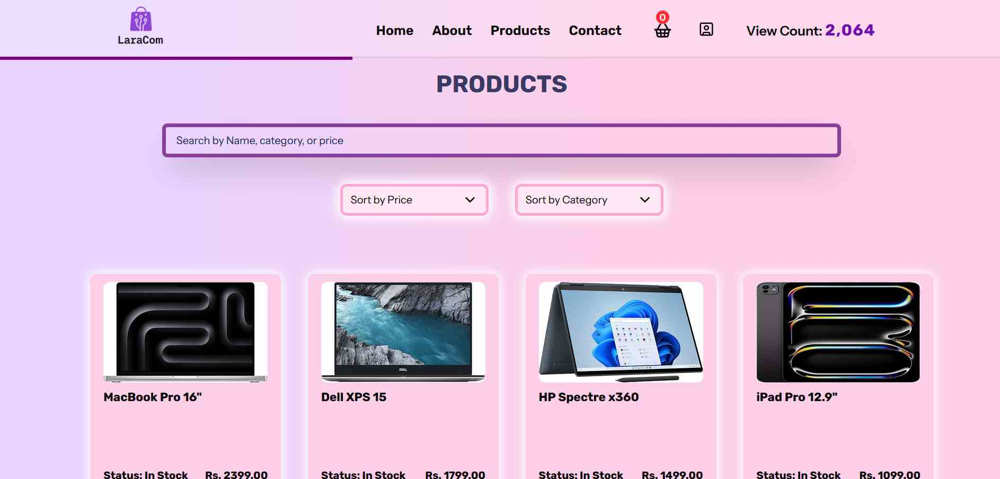
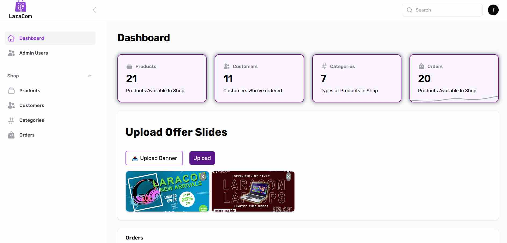
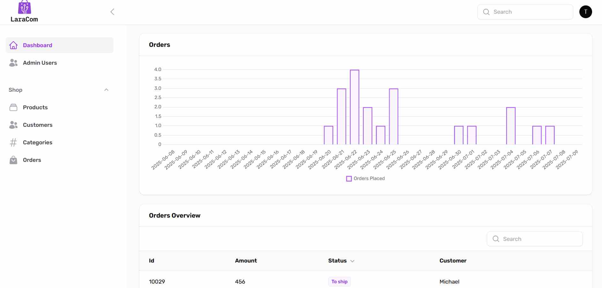
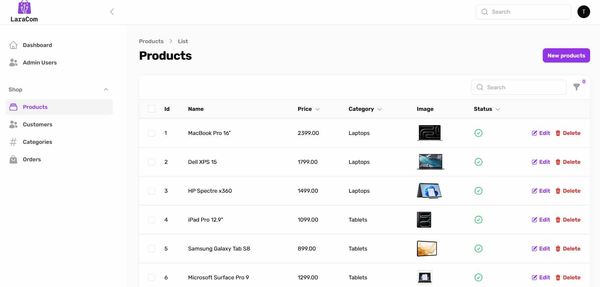

# 🛒 Laracom — eCommerce Store

Laracom is a modern eCommerce platform built with **Laravel**, **Inertia.js**, and **React**, featuring a sleek **Filament** admin dashboard.  
The website is live at 👉 [laracom.tabishsajwani.com](https://laracom.tabishsajwani.com)

---

## 🚀 Tech Stack

- **Laravel** – Backend Framework
- **Inertia.js** – Seamless full-stack routing
- **React** – Frontend UI
- **Typescript** - Strict type casting
- **Filament** – Admin panel management
- **Tailwind CSS** – Styling

---

## 📸 Screenshots

### 1. Storefront Screenshot


### 2. Offers Slider Screenshot


### 3. Product Section



### 4. Admin Panel Screenshot



### 5. Orders View Bar Chart



### 6. Products Admin Panel



## ✨ Features

### 🛍️ Storefront

- **Product Management** – Browse products with category & price filters
- **Customer Auth** – Register, login, and place orders
- **Validation** – Secure server-side validation using Laravel

### 🧑‍💼 Admin Panel (via Filament)

- **Manage Products** – Add, edit, or remove products
- **Manage Categories** – Organize products by category
- **Manage Orders** – Track and update customer orders
- **Dashboard Widgets** – At-a-glance stats for products, orders, and customers
- **Bar Chart** - View number of orders in past one month

---

## 🛠️ Installation Instructions

Follow these steps to run Laracom locally:

### 1. Clone the Repository

```bash
git clone https://github.com/tabby8612/LaraCom.git
cd LaraCom
```

### 2. Install PHP Dependencies

```bash
composer install
```

### 3. Install JavaScript Dependencies

```bash
npm install
```

### 4. Setup Environment

```bash
cp .env.example .env
php artisan key:generate
```

Then edit the .env file to set up your database credentials

### 4. Run Server

```bash
composer run dev
```

---

## 🔗 Live Demo

👉 https://laracom.tabishsajwani.com

---

## 📧 Contact

👉 For questions or feedback, feel free to reach out via GitHub or https://tabishsajwani.com
